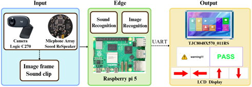
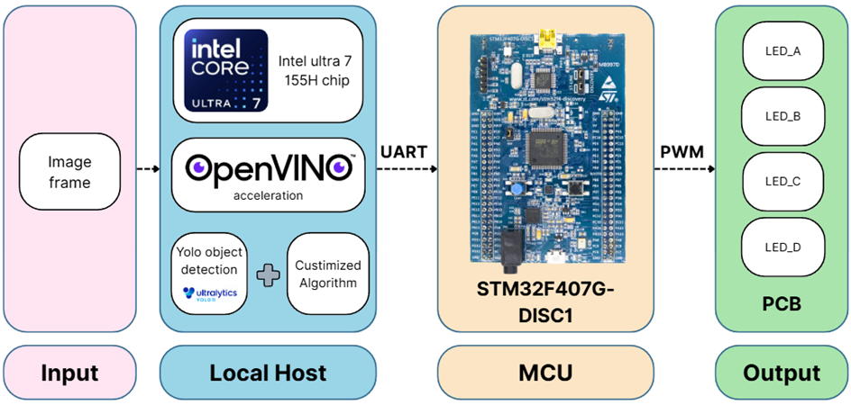
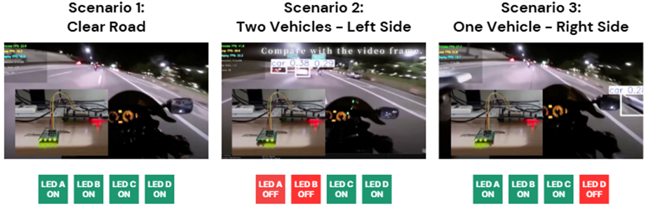
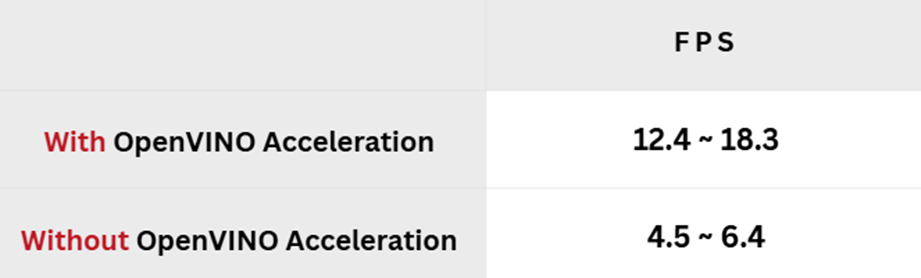

# projects
A collection of academic projects and assignments from my university studies.

## major project 1 : Real-Time Intelligent Traffic Alert System
**【多模態感測與邊緣運算的即時智慧交通警示系統】**

### 專案簡介
本專題提出一個整合 **影像辨識、聲音辨識** 及 **邊緣運算** 的智慧交通警示系統，針對行人保護與緊急事故應變進行優化，提升都市交通安全。  
系統基於 **Raspberry Pi 5**，結合 **YOLOv11**、CNN 聲音模型與影像增強演算法，實現**即時行人偵測、緊急車輛方向提示**及**影像場景優化**。

### 專案目標
- **行人安全**：偵測穿越斑馬線的行人並提醒駕駛。
- **事故應變**：辨識緊急車輛警報器方向，協助駕駛讓道。
- **影像優化**：針對夜間、強光與雨天環境進行影像增強，提高偵測精準度。

### 技術整合
- **硬體**：Raspberry Pi 5、ReSpeaker 麥克風陣列、LCD 顯示模組
- **AI 模型**：
  - YOLOv11n (ONNX) — 行人偵測
  - CNN — 警報聲辨識與方向判斷
  - MobileNetV3-Large — 場景分類
- **工具**：OpenCV、PyTorch、OpenVINO、UART

### 我的貢獻
- **AI 模型整合**：負責 YOLOv11 偵測模組與 OpenVINO 推論加速。
- **場景優化演算法**：設計夜間、雨天、強光等環境的影像增強流程。
- **聲音辨識模組**：參與 CNN 模型訓練與方向辨識測試。
- **系統整合**：完成影像與聲音模組在 Raspberry Pi 上的多執行緒整合與 LCD 呈現。

### 成果展示
| 模組             | 精準率 | 召回率 | F1-score | FPS |
|------------------|--------|--------|----------|------|
| YOLOv11n 行人偵測 | 91%    | 87%    | 0.89     | 6.03 |
| CNN 警報聲辨識   | 92%    | 92%    | 0.96     | 即時 |
| 場景分類         | 87.5%    | -    | -        | 即時 |

---

## major project 2 : Motorcycle Adaptive Driving Beam (ADB) Lighting System
**【結合視覺辨識與 OpenVINO 加速的摩托車智慧型 ADB 照明系統】**

### 專案簡介
本專題設計一套 **摩托車智慧型自適應車燈系統 (ADB)**，利用 **YOLOv11m** 進行物體偵測，並透過 **OpenVINO** 在 Intel CPU 平台進行推論加速，依據偵測結果即時調整車燈亮度，避免眩光同時維持駕駛視線清晰。  
該專題入選 **CYCU × Intel × ASUS AI PC OpenVINO 專題競賽**。

### 專案目標
- **即時偵測**：快速辨識車輛、行人及自行車，適應高速行駛場景。
- **動態照明**：依物體位置即時調整四區域 LED 車燈亮度。
- **低功耗與低成本**：結合 Intel CPU 與 OpenVINO，在無 GPU 的情況下達到嵌入式即時推論。

### 技術整合
- **硬體**：Intel Core Ultra 7、STM32F407G-DISC1 MCU、LED 模擬模組
- **AI 模型**：YOLOv11m + OpenVINO INT8 量化
- **演算法**：畫面四區域分割 + 亮度等級決策
- **工具**：OpenVINO Toolkit、PyTorch、UART、PWM 控制

### 我的貢獻
- **YOLOv11m 模型選型與優化**：分析 YOLOv11 各變體 (n/s/m) 的 FPS 與準確率，最終採用 YOLOv11m。
- **OpenVINO 加速**：負責將 YOLO 模型移植到 Intel 平台，提升推論 FPS 約 2.5 倍。
- **車燈控制演算法**：設計四區域亮度調節邏輯，並透過 UART 與 MCU 連動。
- **系統整合**：完成模型推論、演算法決策、硬體控制的串接。

### 成果展示
測試結果圖，分為三情境

OpenVino 加速對照圖 
